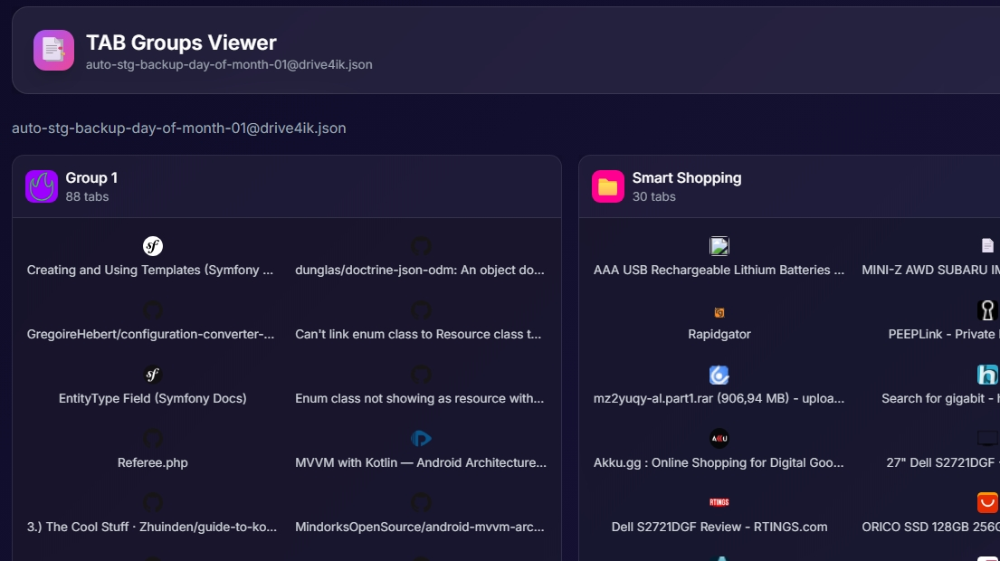

# TAB Groups Viewer

A modern HTML viewer for [Simple Tab Groups](https://addons.mozilla.org/en-US/firefox/addon/simple-tab-groups/) browser extension backups.

## About

This tool lets you browse and view tab groups saved by the [Simple Tab Groups](https://addons.mozilla.org/en-US/firefox/addon/simple-tab-groups/) Firefox extension by [drive4ik](https://github.com/drive4ik/simple-tab-groups).

The extension automatically backs up your tab groups to JSON files. This viewer provides a beautiful interface to explore those backups.

## Screenshot



## Quick Start

1. **Start a local server** in this folder:
   ```bash
   python -m http.server 8000
   ```

2. **Open in browser:**
   ```
   http://localhost:8000/tab-groups-viewer.html
   ```

## Features

- **Grid View**: All groups displayed as cards with tab icons
- **Drill-down**: Click a group to see full tabs with thumbnails
- **Quick Open**: Click any favicon to open the website directly
- **Browse Backups**: Navigate between 31 backup files (arrow buttons or keyboard)
- **Stay on Group**: When switching backups, the current group view stays open
- **Keyboard Shortcuts**: Press `n`/`p` or arrow keys to switch backups

## Navigation

- **Groups View**: Shows all groups as cards with favicon previews
- **Group Detail**: Click a group card to see all tabs with screenshots
- **Breadcrumb**: Click "Groups" to return to the main grid view
- **File Indicator**: Current backup file name shown in header

## Keyboard Shortcuts

| Key | Action |
|-----|--------|
| `n` or `→` (Right Arrow) | Next backup file |
| `p` or `←` (Left Arrow) | Previous backup file |
| Click **→** button | Next backup file |
| Click **←** button | Previous backup file |

## Requirements

- A modern web browser
- Python (for local server) or any HTTP server

## Troubleshooting

**"File not found" error**: Make sure you're running a local HTTP server, not opening the file directly. Browsers block local file access for security.

**No tabs showing**: Check that the JSON files are in the same folder as the HTML file.
